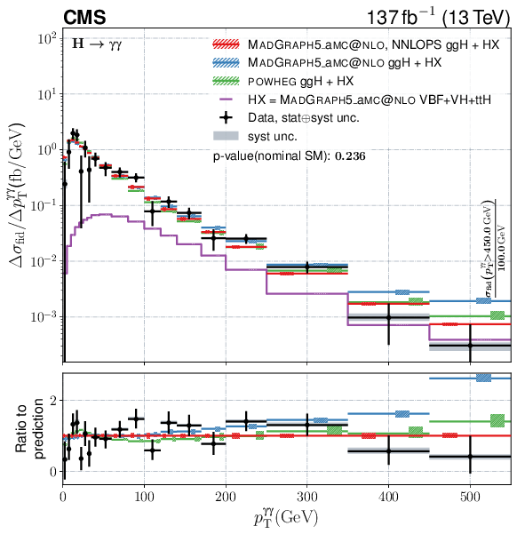

# Effective Field Theories Fits using Differential Cross Sections Measurements

In this project you will use differential cross sections measurements from real CMS analyses and Effective Field Theory predictions to set constraints on parameters that describe physics beyond the Standard Model.

The tasks in what follows will be referenced to as **M** if they are mandatory for the project and **A** if they are advanced. Read carefully the **entire** guide before starting.

## Differential Cross Sections Measurements

Since the discovery of the Higgs boson (2012), a lot of effort has been devoted to investigate its properties and test the SM predictions. Measuring cross sections of the Higgs boson produced in the collisions and decaying in a certain final state (e.g. $\gamma \gamma$, ZZ, WW, etc.) is one of the main studies that are repeated by CMS and ATLAS during every run of the LHC. Measuring *differential* cross sections for these events consists in these very simplified steps:
- pick a handful of observables related to the Higgs boson (e.g. Higgs transverse momentum, number of jets in the final state, etc.);
- define bins for each of these observables;
- estimate the cross sections in each of these bins.

Following this procedure it is possible to get *spectra* like this one



which shows the spectrum of the Higgs transverse momentum $p_T^H$ measured on the $H\rightarrow \gamma \gamma$ channel. 

Note that in this project you won't be asked to measure differential cross sections, but these measurements will be one of the inputs for your work.

## Effective Field Theories

Effective Field Theories (EFTs) aim to constraint New Physics (NP) in a model independent way. The idea consists in extending the SM Lagrangian with new operators, each paired to a certain **Wilson coefficient** (WC), as follows:

$$\mathcal{L}_{\mathrm{SMEFT}}=\mathcal{L}_{\mathrm{SM}}+ \sum_{i} \frac{c_j^{(6)}}{\Lambda^2} O_j^{(6)} + \mathcal{O}(\Lambda^{-4})$$

As it is clear from the equations, WCs different from 0 might represent a hint of NP.
But how can we investigate this behavior using differential cross section measurements? Values of WCs different from 0 change the **number of signal events** that we see in each bin of a differential cross section measurement. More clearly, we can say that the **signal strength** $\mu = \sigma / \sigma_{SM}$ in each bin of a certain differential cross section measurement **is a function of the WCs**, i.e. $\mu = \mu(\vec{c})$.

Using the **narrow width approximation**:
$$\sigma(gg\rightarrow H \rightarrow X) = \sigma(gg \rightarrow H) \cdot \mathrm{BR}(H\rightarrow X) = \sigma(gg \rightarrow H) \cdot \frac{\Gamma^{H \rightarrow X}}{\Gamma^{\mathrm{tot}}}$$
the signal strength in a certain bin $i$ for a Higgs boson decaying in a certain way $X$ can be written as:
$$\mu^{X}_{i}(c_{j}) =  \frac{\sigma_{SMEFT}(gg \rightarrow H)}{\sigma_{SM}(gg \rightarrow H)} \cdot \frac{\Gamma^{H \rightarrow X}_{SMEFT} / \Gamma^{H \rightarrow X}_{SM}}{\Gamma^{H}_{SMEFT} / \Gamma^{H}_{SM}}$$
where we distinguish the three main parts:
- production: $\frac{\sigma_{SMEFT}(gg \rightarrow H)}{\sigma_{SM}(gg \rightarrow H)} = 1+\sum_{j} A_{j}^{gg \rightarrow H} c_{j}+\sum_{j k} B_{j k}^{gg \rightarrow H} c_{j} c_{k}$
- decay to $X$: $\frac{\Gamma^{H \rightarrow X}_{SMEFT}}{\Gamma^{H \rightarrow X}_{SM}} = 1+\sum_{j} A_{j}^{H \rightarrow X} c_{j}+\sum_{j k} B_{j k}^{H \rightarrow X} c_{j} c_{k}$
- total decay: $\frac{\Gamma^{H}_{SMEFT}}{\Gamma^{H}_{SM}} = 1+\sum_{j} A_{j}^{H} c_{j}+\sum_{j k} B_{j k}^{H} c_{j} c_{k}$

As explained in the next section, the coefficients $A$ and $B$ (respectively linear and quadratic) that define the function in each bin will be given you as input for your project.

## Input files

```DiffXS``` and ```EFTPredictions``` contain the inputs for your project. In the rest of this section we describe format and content of both.

### DiffXS
```
.
├── HWW_pTH_correlation_matrix_expected.json
├── HWW_pTH_correlation_matrix_observed.json
├── HWW_ptH_mus.json
├── HZZ_pTH_correlation_matrix_expected.json
├── HZZ_ptH_correlation_matrix_observed.json
├── HZZ_ptH_mus.json
├── Hgg_ptH_correlation_matrix_expected.json
├── Hgg_ptH_correlation_matrix_observed.json
└── Hgg_ptH_mus.json
```

This directory contains two types of JSON files:

1. ```<decay channel>_<observable>_mus.json```

These files contains a dictionary of elements like e.g.
```
    "r_smH_PTH_0_5": {
        "bestfit": 0.3345899921962362,
        "Up01Sigma": 0.5066128060188576,
        "Down01Sigma": 0.5722062180535982,
        "Up01SigmaExp": 0.4355968524408629,
        "Down01SigmaExp": 0.4320067145959119
    },
```
where each key refers to a bin (in this case between 0 and 5 GeV) of a certain ```<observable>``` (in this case Higgs pt). The keys of the dictionary refer to:

- ```bestfit```: the best fit found for the value of $\mu$ in this bin using **observed** data
- ```Up01Sigma```: up uncertainty on the **observed** value of $\mu$ at 68\% CL
- ```Down01Sigma```: down uncertainty on the **observed** value of $\mu$ at 68\% CL
- ```Up01SigmaExp```: up uncertainty on the **expected** value of $\mu$ at 68\% CL
- ```Down01SigmaExp```: down uncertainty on the **expected** value of $\mu$ at 68\% CL

As you have seen (or will see) during the lectures, the expected results have been produced using the *Asimov datasets*, and represent what we would see if the data that we have were produced according to the SM. Now you might wonder, why there is no ```bestfitExp``` in the dictionary? Following the definition of $\mu = \sigma/\sigma_{SM}$, the expected value of $\mu$ is always 1.

2. ```<decay channel>_<observable>_correlation_matrix_<expected/observable>.json```

These files contain a *JSON-ized* version of the correlation matrices obtained when performing a combined fit of the signal strengths in all the bins of a certain ```<observable>```. For instance, a dictionary like the following:
```
    "r_smH_PTH_0_10": {
        "r_smH_PTH_0_10": 1.0,
        "r_smH_PTH_10_20": -0.05706247229485781,
        "r_smH_PTH_20_30": 0.09718704269547643,
        "r_smH_PTH_30_45": 0.0841263411144703,
        "r_smH_PTH_45_60": 0.07032449321240183,
        "r_smH_PTH_60_80": 0.06608862919313668,
        "r_smH_PTH_80_120": 0.06723715998091676,
        "r_smH_PTH_120_200": 0.060033110082079545,
        "r_smH_PTH_GT200": 0.04804661116091705
    },
```
contains the correlations between ```r_smH_PTH_0_10``` and itself (clearly 1), ```r_smH_PTH_0_10``` and ```r_smH_PTH_10_20``` (-0.05706247229485781), etc.

You will notice that you have been provided with files for **three decay channels** (Hgg, HZZ and HWW) and only **one observable** (ptH).