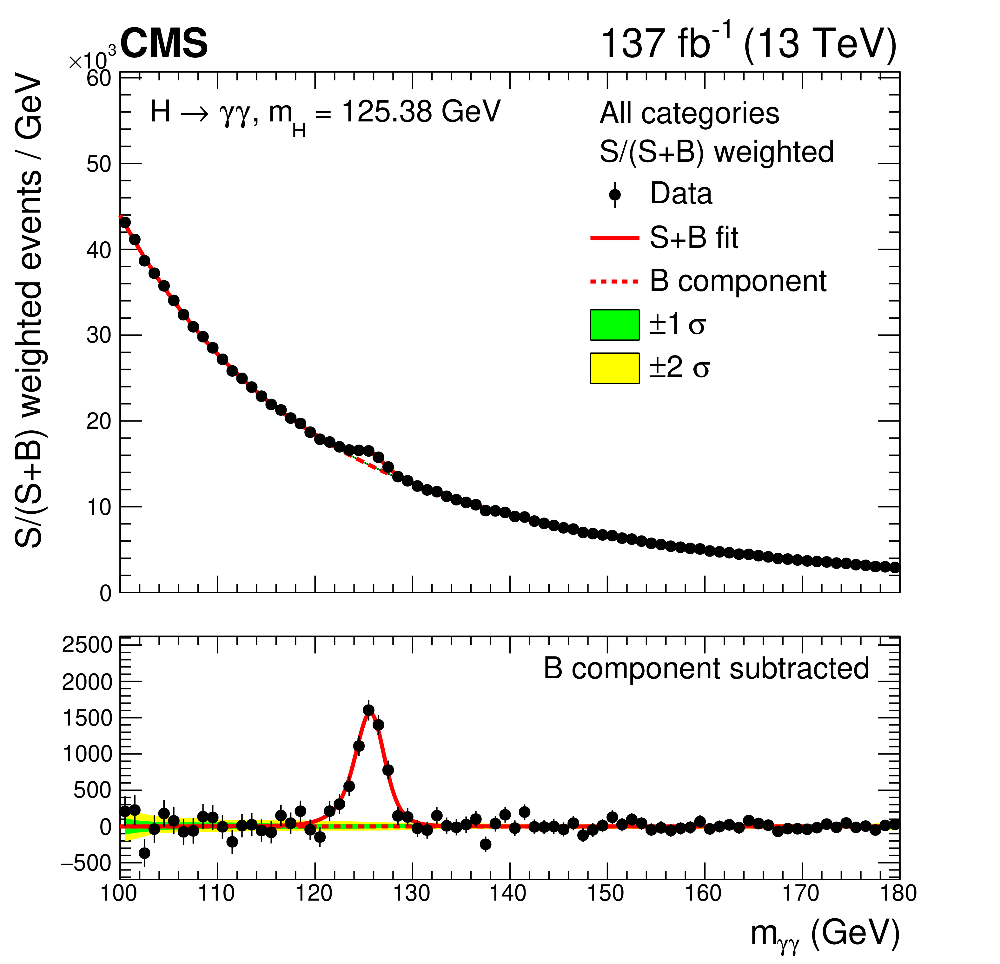
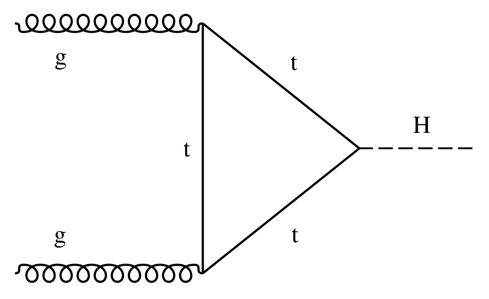
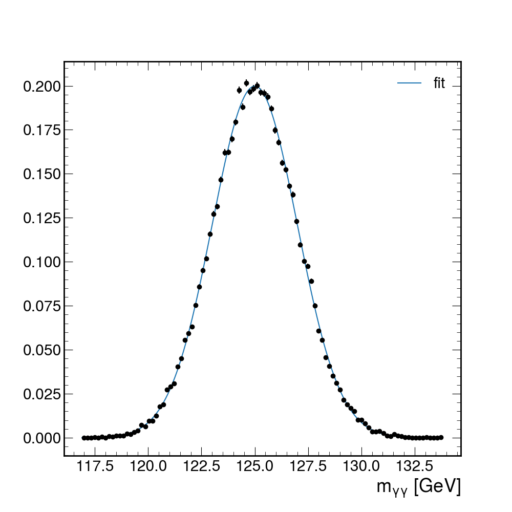
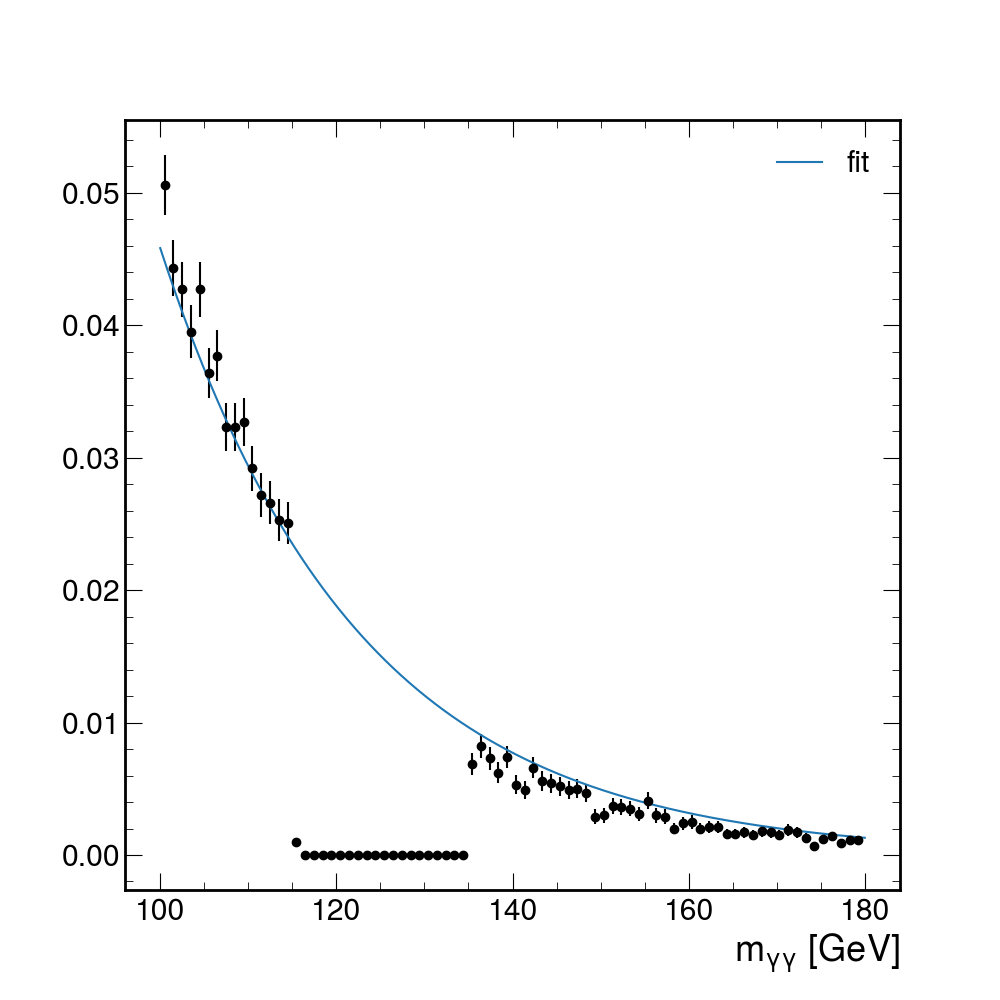
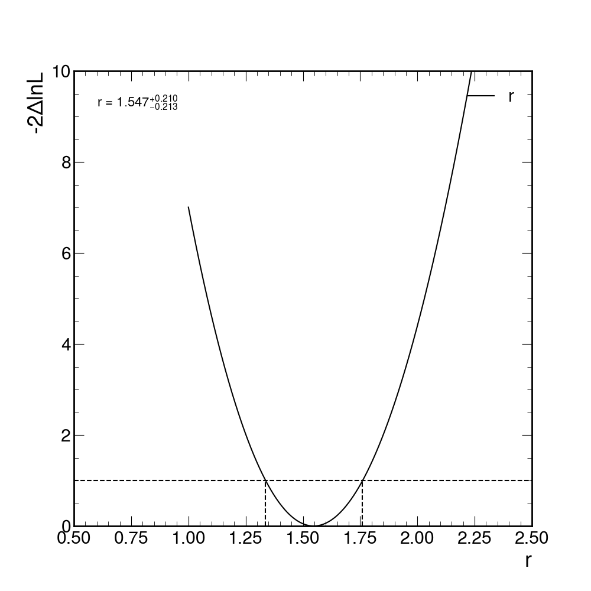
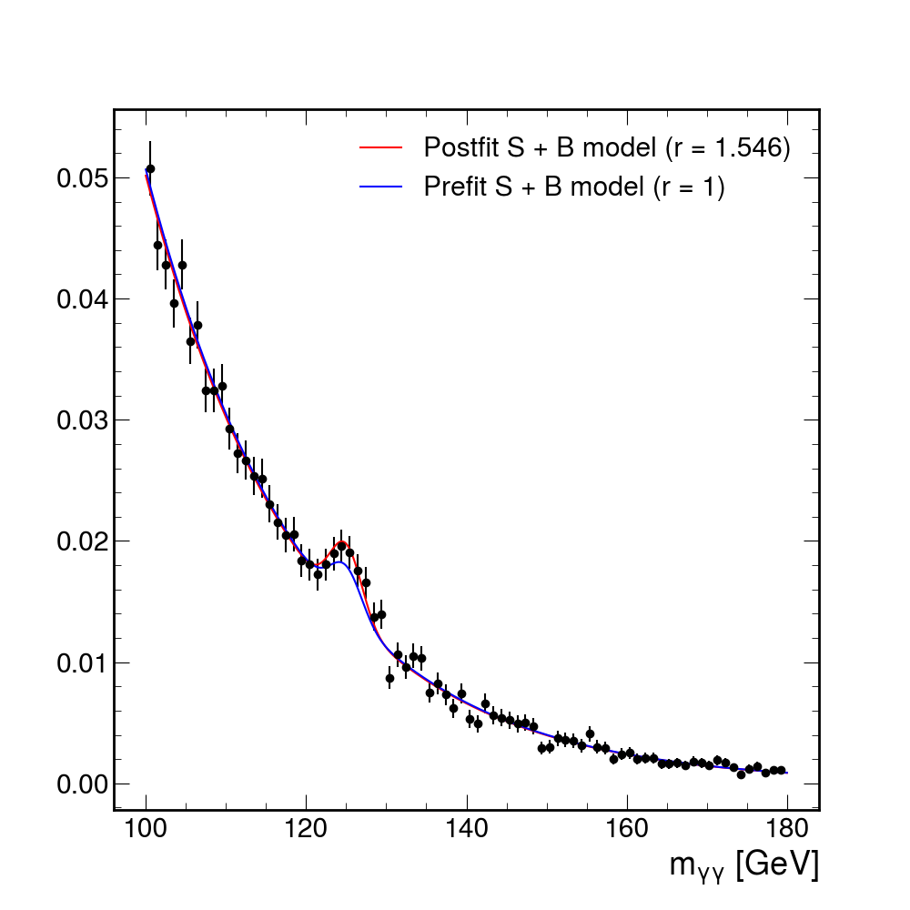
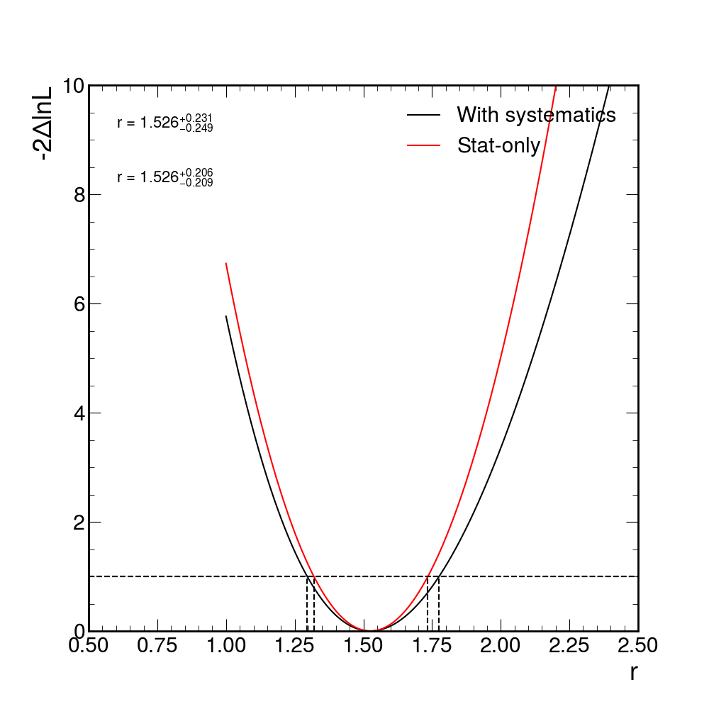
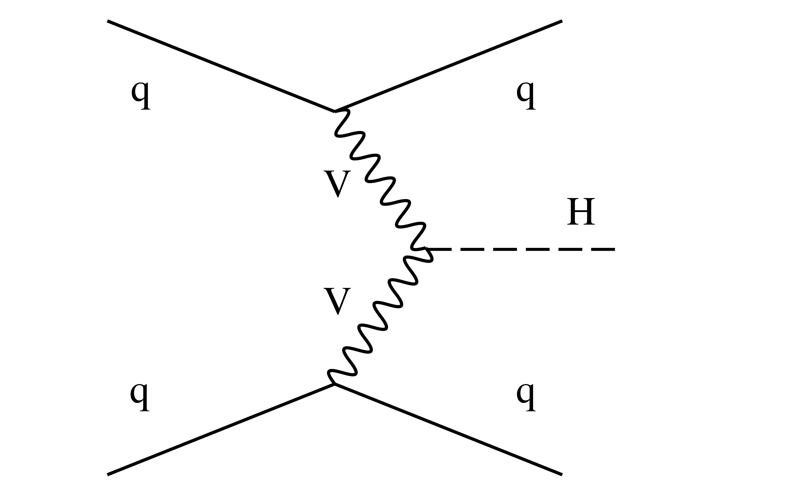
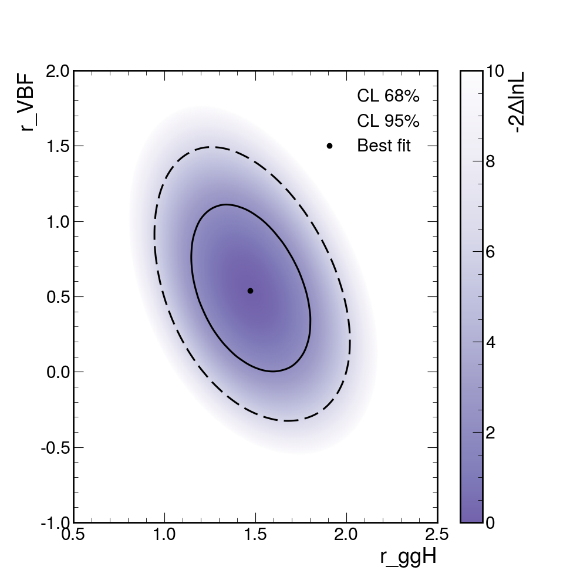

# $H \rightarrow \gamma \gamma$ Parametric Fitting

In this project we will look at one of the most famous parametric fitting analyses at the LHC: the Higgs boson decaying to two photons (H → γ γ). This decay channel is key in understanding the properties of the Higgs boson due to its clean final state topology. The excellent energy resolution- of the CMS electromagnetic calorimeter leads to narrow signal peak in the diphoton invariant mass spectrum, $m_{\gamma\gamma}$, above a smoothly falling background continuum. The mass spectrum for the legacy Run 2 analysis is shown below.



In the analysis, we construct parametric models (analytic functions) of both signal and background events to fit the $m_{\gamma\gamma}$ spectrum in data. From the fit, one can extract measurements of Higgs boson properties including its rate of production, its mass $m_{H}$, its coupling behavior, to name a few. 

The project is divided into four parts. You are required to provide results for as many parts as you can, but it is not a problem if you do not finish.

Note that performing the following tasks using only ```scipy``` libraries might be extremely challenging. Instead, we suggest to use [zfit](https://zfit.readthedocs.io/en/latest/) and its [tutorials](https://github.com/zfit/zfit-tutorials), where you should find pretty much everything you need.

## Part 1: parametric model building

As with any fitting exercise, the first step is to understand the format of the input data, explore its contents and construct a model.

### Signal modelling

Firstly, you have to construct a model to fit the signal (H → γ γ) mass peak using a Monte Carlo simulation sample of gluon-gluon fusion production (ggH) events with $m_H$ = 125 GeV. This production mode has the largest cross section in the SM, and the LO Feynman diagram is shown below.



There has already been a dedicated selection performed on the events to increase the signal-to-background ratio (e.g. using some ML event classifier). Events passing this selection enter the analysis category, Tag0. Events entering Tag0 are used for the parametric fitting of the $m_{\gamma\gamma}$ spectrum.

The events are stored in a parquet file, where the diphoton mass ```CMS_hgg_mass``` and the event weight ```weight``` are saved.

```
In [1]: import pandas as pd

In [2]:

In [2]: df = pd.read_parquet("data/mc_part1.parquet")

In [3]: df
Out[3]:
       CMS_hgg_mass        weight
0        126.997864  2.623320e-08
1        124.130470  2.623320e-08
2        126.563591  2.623320e-08
3        124.939896  2.623320e-08
4        126.648529  2.623320e-08
...             ...           ...
49995    129.451614  2.623320e-08
49996    126.068733  2.623320e-08
49997    123.752129  2.623320e-08
49998    124.744652  2.623320e-08
49999    122.873337  2.623320e-08

[50000 rows x 2 columns]
```

You can plot now the events and fit a signal model to it. The signal model should be defined as a Gaussian where the mean also takes into consideration reconstruction effects, and can hence be written as

$$\mu = m_{H} + \delta$$

and you allow $\delta$ to float in the fit. After plotting the fitted Gaussian on the MC distribution, you should see something like this.



At this point you have successfully constructed a parametric model to fit the shape of the signal peak, but the yield/normalization of the ggH signal process is also needed. In the SM, the ggH event yield in Tag0 is equal to:

$$ N = \sigma_{ggH} \cdot \mathcal{B}^{\gamma\gamma} \cdot \epsilon \cdot \mathcal{L}$$

Where $\sigma_{ggH}$ is the SM ggH cross section, $\mathcal{B}^{\gamma\gamma}$ is the SM branching fraction of the Higgs boson to two photons, $\epsilon$ is the efficiency factor and corresponds to the fraction of the total ggH events landing in the Tag0 analysis category. $\mathcal{L}$ is the integrated luminosity.

For $\sigma_{ggH}$, $\mathcal{B}^{\gamma\gamma}$ and $\mathcal{L}$ you can use the following values:

```
>>> xs_ggH = 48.58 #in [pb]
>>> br_gamgam = 2.7e-3
>>> lumi = 138000
```

$\epsilon$ should be computed by taking the sum of weights in the MC dataset and dividing through by $\sigma_{ggH} \cdot \mathcal{B}^{\gamma\gamma}$.

### Background modelling

In the H → γ γ analysis we construct the background model directly from data. To avoid biasing our background estimate, we remove the signal region from the model construction and fit the mass sidebands. The events are stored in a parquet file called ```data/data_part1.parquet```:

```
In [1]: import pandas as pd

In [2]: df = pd.read_parquet("data/data_part1.parquet")

In [3]: df
Out[3]:
      CMS_hgg_mass  weight
0       110.953629     1.0
1       122.949226     1.0
2       112.621597     1.0
3       154.064850     1.0
4       132.254532     1.0
...            ...     ...
9995    154.357010     1.0
9996    146.731079     1.0
9997    148.076965     1.0
9998    104.958755     1.0
9999    100.259827     1.0

[10000 rows x 2 columns]
```

Plot the data and fit a falling exponential to the sidebands. More specifically, you should exclude the data in the region [115, 135].



As the background model is extracted from data, you also need to introduce a freely floating normalisation term. The starting value should be the total number of data events (including the ones in the signal region) and the range should be (0, 3 * number of events).

## Part 2: fit of ggH signal strength

Now you have all the ingredients to build the full model (as a sum of the signal and background models) and, consequently, the likelihood (which is going to be unbinned). In these cross section measurements, we usually define the parameter of interest (POI) as ```r```, defined as:

$$r = \frac{\sigma}{\sigma_{SM}}$$

You can introduce this parameter in the model as a factor that multiplies the signal yield. The likelihood you build from this model looks like this:

$$L(\text { data } \mid r)=\frac{1}{N} \cdot \prod_i^{\text {events }}\left[r \cdot S \cdot f_s\left(m_{\gamma \gamma}\right)+B \cdot . f_b\left(m_{\gamma \gamma}\right)\right] \cdot e^{-(r \cdot S+B)}$$

Now you have everything you need to find the values of ```r``` that maximize the likelihood (or minimize the negative log-likelihood)! More specifically, you need to provide a confidence interval for the POI. To do this, you can define the profile likelihood ratio:

$$\lambda(r)=\frac{L(r, \hat{\hat{\theta}})}{L(\hat{r}, \hat{\theta})}$$

If you perform a *scan* of the POI and plot the value of $-2\lambda(r)$ you can produce a plot like the following:



where the **68\% CL interval** is given by the points at which $-2\lambda(r)$ is 1 (remember [Wilk's theorem](https://statproofbook.github.io/P/ci-wilks)!).

Note that when you perform the scan, the following parameters have to be frozen (i.e., not allowed to float) in the fit:

- $m_H$ (set to 125 GeV)
- $\delta$, set to the best fit found in part 1
- $\sigma$, set to the best fit found in part 1
- $\sigma_{ggH}$, $\mathcal{B}^{\gamma\gamma}$, $\epsilon$ and $\mathcal{L}$, set to the values introduced in part 1

If you then plot the S + B model with the best-fit values, you will see something like this:



## Part 3: systematic uncertainties

In this part you are required to add four different systematic uncertainties to the model and study their impact on the fit. Inside the directory ```data``` you can find MC sampels with the following naming scheme ```mc_part3_ggH_Tag0_<uncertainty name><direction>01Sigma.parquet```, where:

- ```<uncertainty name>``` can be one of the four sources of uncertainty we are considering, i.e. jet energy scale ```JEC```, photon identification ```photonID```, ```scale``` and ```smear```;
- ```<direction>``` can be either ```Up``` or ```Down```, reflecting the fact that the sample has been produced with the uncertainty source at $+1\sigma$ or $-1\sigma$.

The jet energy scale (JEC) and photon identification (photonID) uncertainties do not affect the shape of the $m_{\gamma\gamma}$ distribution i.e. they only effect the signal yield estimate. We can calculate their impact by comparing the sum of weights to the nominal dataset. Note, the photonID uncertainty changes the weight of the events in the tree, whereas the JEC varied trees contain a different set of events, generated by shifting the jet energy scale in the simulation. In any case, the means for calculating the yield variations are equivalent:

```
In [1]: import pandas as pd

In [2]: nominal_file = "data/mc_part3_ggH_Tag0.parquet"

In [3]: file_template = "data/mc_part3_ggH_Tag0_{}01Sigma.parquet"

In [4]: var_name = "CMS_hgg_mass"

In [5]: df_nominal = pd.read_parquet(nominal_file)

In [6]: yield_variations = {}
   ...: for sys in ["JEC", "photonID"]:
   ...:     for direction in ["Up", "Down"]:
   ...:         fl = file_template.format(sys + direction)
   ...:         df = pd.read_parquet(fl)
   ...:         numerator = df[var_name] * df["weight"]
   ...:         denominator = df_nominal[var_name] * df_nominal["weight"]
   ...:         yld = numerator.sum() / denominator.sum()
   ...:         print("Systematic varied yield ({}, {}) = {:.3f}".format(sys, direction, yld))
   ...:         yield_variations[sys + direction] = yld
   ...:
Systematic varied yield (JEC, Up) = 1.056
Systematic varied yield (JEC, Down) = 0.951
Systematic varied yield (photonID, Up) = 1.050
Systematic varied yield (photonID, Down) = 0.950
```

These numbers can then be used to define a new parameter that multiplies the signal yield:

$$s \rightarrow s \cdot \kappa^{\theta}$$

where $\kappa = 1 + \Delta x / x$ is the value we found above and $\theta$ is a nuisance parameter that will be introduced as a gaussian constraint with $\mu = 0$ and $\sigma = 1$ in the fit. This way, when $\theta = 0$ the nominal yield is retained, at $\theta = 1\sigma$ the yield is multiplied by $\kappa$ and at $\theta = -1\sigma$ the yield is multiplied by $1/\kappa$.
For the photon ID, where the varied yield, you can implement the multiplier as follows:

```
theta = zfit.Parameter("theta", 0, -5, 5)

def yield_multiplicative_factor_function(theta):
    return yield_variations["photonIDUp"]**theta

yield_multiplicative_factor = zfit.ComposedParameter(
    "yield_multiplicative_factor",
    yield_multiplicative_factor_function,
    (theta,),
)
```

You can do the same with the JEC uncertainty taking the upper variation, which is the largest between up and down, or implement it taking into consideration the fact that up and down are asymmetric:

```
def yield_multiplicative_factor_asymm_function(theta):
    kappa_up = yield_variations["JECUp"]
    kappa_down = yield_variations["JECDown"]
    theta_val = theta.value().numpy()
    # see CAT-23-001-paper-v19.pdf pag 7
    if theta_val < -0.5:
        return kappa_down ** (-theta)
    elif theta_val > 0.5:
        return kappa_up**theta
    else:
        return tf.math.exp(
            theta
            * (
                4 * tf.math.log(kappa_up / kappa_down)
                + tf.math.log(kappa_up * kappa_down)
                * (48 * theta**5 - 40 * theta**3 + 15 * theta)
            )
            / 8
        )
```

The other two uncertainties, photon and energy scale and smearing uncertainities, affect the shape of the mass distribution. More specifically, the scale uncertainty will affect the mean of the signal Gaussian, while the smear uncertainty will impact the resolution (sigma). Running the following code

```
mass = zfit.Space(var_name, limits=(100, 180))
higgs_mass = zfit.Parameter("higgs_mass", 125, 124, 126)
sigma = zfit.Parameter("sigma", 2, 1.5, 2.5)
gaus = zfit.pdf.Gauss(mu=higgs_mass, sigma=sigma, obs=mass)

z_mc_nominal = zfit.Data.from_pandas(df_nominal, obs=var_name)
nll = zfit.loss.UnbinnedNLL(gaus, z_mc_nominal)
minimizer = zfit.minimize.Minuit(use_minuit_grad=True)
result = minimizer.minimize(nll)
result.hesse()
print(result)
best_values = {}
best_values["nominal"] = {p.name: p.numpy() for p in result.params}

for sys in ["scale", "smear"]:
    for direction in ["Up", "Down"]:
        fl = file_template.format(sys + direction)
        df = pd.read_parquet(fl)
        z_mc = zfit.Data.from_pandas(df, obs=var_name)
        nll = zfit.loss.UnbinnedNLL(gaus, z_mc)
        minimizer = zfit.minimize.Minuit(use_minuit_grad=True)
        result = minimizer.minimize(nll)
        result.hesse()
        print(result)
        best_values[sys + direction] = {p.name: p.numpy() for p in result.params}
print(best_values)

# get scale shift
scale_shift_up = (
    np.abs(best_values["scaleUp"]["higgs_mass"] - best_values["nominal"]["higgs_mass"])
    / best_values["nominal"]["higgs_mass"]
)
scale_shift_down = (
    np.abs(
        best_values["scaleDown"]["higgs_mass"] - best_values["nominal"]["higgs_mass"]
    )
    / best_values["nominal"]["higgs_mass"]
)
scale_shift = (scale_shift_up + scale_shift_down) / 2
print("Scale shift = {:.3f}".format(scale_shift))

# get smear shift
smear_shift_up = (
    np.abs(best_values["smearUp"]["sigma"] - best_values["nominal"]["sigma"])
    / best_values["nominal"]["sigma"]
)
smear_shift_down = (
    np.abs(best_values["smearDown"]["sigma"] - best_values["nominal"]["sigma"])
    / best_values["nominal"]["sigma"]
)
smear_shift = (smear_shift_up + smear_shift_down) / 2
print("Smear shift = {:.3f}".format(smear_shift))
```

shows that the scale uncertainty (at ±1σ) varies the signal peak mean by around 0.3%, and the smear uncertainty (at ±1σ) varies the signal width (sigma) by around 4.5% (average of up and down variations). In order to bake them into the signal model, proceed as follows.

The mean of the Gaussian was previously defined as:

$$\mu = m_H + \delta$$

We introduce the nuisance parameter η to account for a shift in the signal peak mean using:

$$\mu = (m_H + \delta) \cdot (1 + 0.003\eta)$$

At η = +1(−1) the signal peak mean will shift up (down) by 0.3%. Similar for the width introducing a nuisance parameter, χ:

$$\sigma = \sigma \cdot (1 + 0.045 \chi)$$

You can now assign gaussian constraints (as you did for the other two uncertainties) to $\eta$ and $\chi$ and build the model, that will now look as follows:

$$L(\text { data } \mid r, \vec{\theta}) = [\frac{1}{N} \cdot \prod_i^{\text {events }}\left[r \cdot S(\vec{\theta}) \cdot f_s\left(m_{\gamma \gamma}\right)+B \cdot f_b\left(m_{\gamma \gamma}\right)\right] \cdot e^{-(r \cdot S(\vec{\theta})+B)}] \cdot \mathcal{C}(\vec{\theta})$$

You can then run scans for the POI with and without systematic uncertainties frozen, in order to check their impact on the final confidence interval provided. You should find something like this:



## Part 4: multi-signal model

In reality, there are multiple Higgs boson processes which contribute to the total signal model, not only ggH. In this section you will have to add an additional signal process (VBF) into the fit. Following this, a second analysis category (Tag1) is used, which has a higher purity of VBF events. To put this in context, the selection for Tag1 may require two jets with a large pseudorapidity separation and high invariant mass, which are typical properties of the VBF topology. By including this additional category with a different relative yield of VBF to ggH production, we are able to simultaneously constrain the rate of the two production modes.

In the SM, the VBF process has a cross section which is roughly 10 times smaller than the ggH cross section. This explains why we need to use certain features of the event to boost the purity of VBF events. The LO Feynman diagram for VBF production is shown below.



### Building the models

The procedure to build the signal and background models is the same that was described in part 1, with two main differences:

- the models have to be derived for both categories in which data is divided, i.e. ```Tag0``` and ```Tag1```
- the signal model has to be derived for both processes that contribute to the signal (ggH and VBF) and each one will have to be scaled by its signal strength parameter (```r_ggH``` and ```r_VBF```)

Each signal model is normalised according to the following equation

$$N_{i j}=\sigma_i \cdot \mathcal{B}^{\gamma \gamma} \cdot \epsilon_{i j} \cdot \mathcal{L}$$

where $\epsilon_{i,j}$ labels the fraction of process, $i$ (=ggH,VBF), landing in analysis category, $j$ (=Tag0,Tag1), and $\mathcal{L}$ is the integrated luminosity. You should use the following values of SM cross sections:

```
xs_ggH = 48.58
xs_VBF = 3.782
```

At this point you can build the full model and perform a 2D scan in order to provide contour plots for ```r_ggH``` and ```r_VBF```. You should obtain something similar to this plot:

