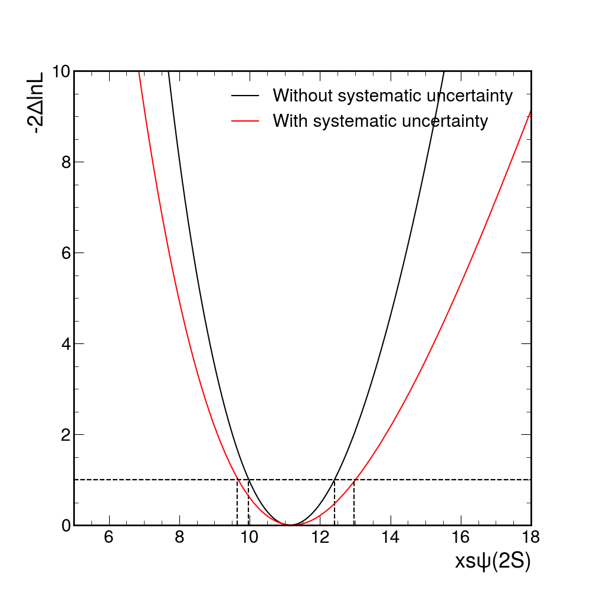
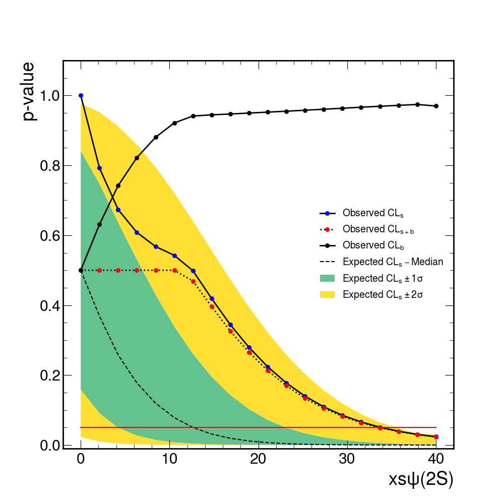

# $\psi(2S)$ Discovery with CMS OpenData

This exercise uses the CMS public data from the 2010 proton-proton run. In particular, the invariant mass spectrum of muon pairs from data is provided. The purpose of the project is to approach the discovery of a "new" particle in the context of the observation of the ψ(2S) resonance in the CMS data.

This is what the distribution of the dimuon invariant mass spectrum looks like with about 2% of the total 2010 statistics:


The J/ψ is of course very visible around the 3.1 GeV mass point, while for the ψ(2S) we expect to see an excess around 3.65 GeV.

The tasks in what follows will be referenced to as **M** if they are mandatory for the project and **A** if they are advanced. Read carefully the **entire** guide before starting.

## Datasets

In this project you are provided with two datasets, ```DataSet_lowstat.pkl``` and ```DataSet.pkl```, which both refer to the invariant mass of a muon-antimuon pair. The difference bitween the two is that ```DataSet_lowstat.pkl``` corresponds to about 20\% of the statistics available in 2010, while ```DataSet.pkl``` contains the full statistics. You will be asked to use the full statistics dataset for the mandatory tasks and the low statistics one for the rest.

## Task 1 - M

In this part you are required to define the model (i.e. the total PDF) and fit it to the invariant mass distribution contained in ```DataSet.pkl```. Here are some tips:

- the observable can be fit in a range of [2, 6] GeV
- to model the J/ψ peak you can use a Crystal Ball distribution with the following values for the parameters (starting value, [low limit, high limit]): mean (3.1, [2.8, 3.4]), sigma (0.3, [0.0001, 1]), alpha (1.5, [-5, 5]), n (1.5, [0.5, 10])
- to model the ψ(2S) peak you can use another Crystal Ball distribution with the following values for the parameters: mean (3.7, [2.5, 3.95]) and sigma, alpha, n like the J/ψ
- to model the background you can use a Chebychev polynomial of order 3, with the first three coefficients having the following values: a1 (-0.7, [-2, 2]), a2 (0.3, [-2, 2]), a3 (-0.03, [-2, 2])

For each of these components, you then need to define a parameter to describe the yield (number of events). Note that since our **Parameter of Interest** is the ψ(2S) **cross section**, rather than the simple number of events, it is convenient to define the latter as a function of the former:

$$N_{\psi(2S)} = \epsilon_{\mu\mu} \cdot \ell \cdot \sigma_{\psi(2S)}$$

where efficiency and luminosity will be set constant to **75\%** and **37 inverse pb** respectively.

For yields and cross section you can use the following (starting value, [low limit, high limit]):

- J/ψ yield (1500, [0, 10000])
- ψ(2S) cross section (3, [0, 40])
- background yield (5000, [0, 50000])

After running the fit and plotting model and distribution, you should obtain something like the following:


## Task 2 - M

With the full statistics dataset the **excess significance** is enough to claim the discovery of a new particle (you can quantify it if you want, but it is not required in this task), so we want to provide a **confidence interval** for our POI. To do so, we can use the **profile likelihood ratio** defined by

$$\lambda(\mu)=\frac{L(\mu, \hat{\hat{\theta}})}{L(\hat{\mu}, \hat{\theta})}$$

where:

- $\mu$ is the value we are testing (ψ(2S) cross section);
- $\hat{\hat{\theta}}$ is the best fit of the nuisance parameters once the $\mu$ we want to test is fixed;
- $\hat{\mu}$ and $\hat{\theta}$ are the best fit values for $\mu$ and $\theta$ when both are left floating in the likelihood.

If you perform a *scan* of the POI and plot the value of $-2\lambda(\mu)$ you can produce a plot like the following:


where the **68\% CL interval** is given by the points at which $-2\lambda(\mu)$ is 1.

## Task 3 - A

In this task we introduce a **systematic uncertainty** and we investigate how this affects the final result. Let's assume we have 10\% uncertainty on the signal efficiency for which we assume a Gaussian behavior. In your model you will have to rewrite the efficiency as 
$$\epsilon = \kappa \cdot \epsilon$$
and insert a Gaussian constraint for $\kappa$.

After deriving also in this case 68\% CL interval you should see something like the following:



in line with the fact that the systematic uncertainty that we introduced increases the size of the CL we found for the POI.

## Task 4 - A
This is the most challenging task and requires using concepts that are going to be introduced only in the last three/four weeks of the course. 

First of all repeat the procedure performed in task 1 using the dataset ```Dataset_lowstat.pkl```, changing the luminosity to **0.64 inverse pb**.

Now compute the **excess significance** of the ψ(2S) peak in units of sigma. What you will see, given the low statistics of the sample, is that the number of sigmas is way too low to claim a discovery of the ψ(2S) resonance.

What happens in these cases is that we set an **upper limit** for our POI (the ψ(2S) cross section) following the prescription described in the [paper](https://arxiv.org/abs/1007.1727?context=hep-ex) *Asymptotic formulae for likelihood-based tests of new physics*. 

The upper limit found with this prescription can be visualized like the following



where the actual value can be found by reading the x-axis value for the point in which the red line (0.05 significance) crosses the black line with red dots.

Now, this might sound scary and overwhelming, but since this is a common practice in HEP there are of course tools that already perform these operations. We will talk about them at the end of the explanation.

## zfit

You might try to perform all the tasks *by hand*, but this will probably require a lot of time! 
Instead, we suggest to use [zfit](https://zfit.readthedocs.io/en/latest/) and its [tutorials](https://github.com/zfit/zfit-tutorials), where you should find pretty much everything you need. In particular, you might want to take a look at [this notebook](https://github.com/zfit/zfit-tutorials/blob/master/guides/constraints_simultaneous_fit_discovery_splot.ipynb) to get the results required in Task 4.